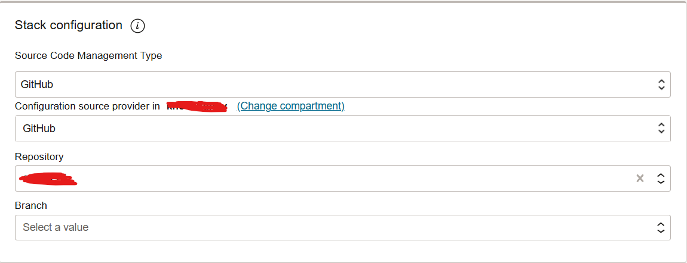
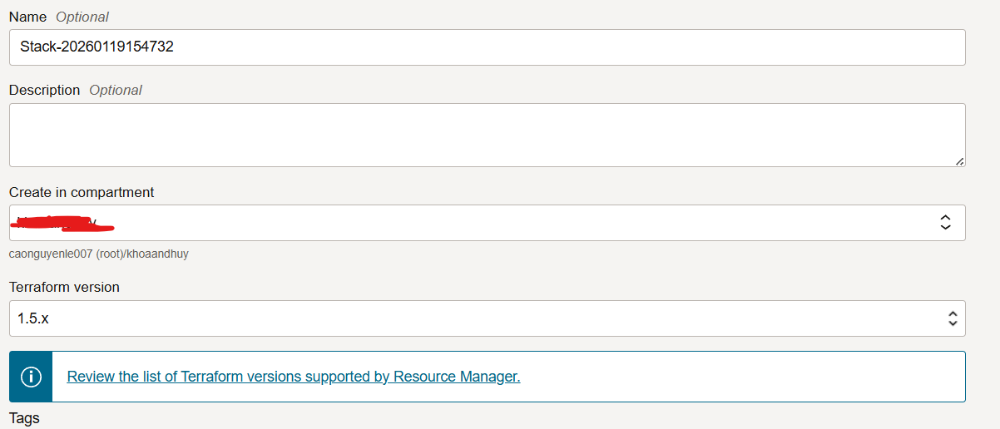
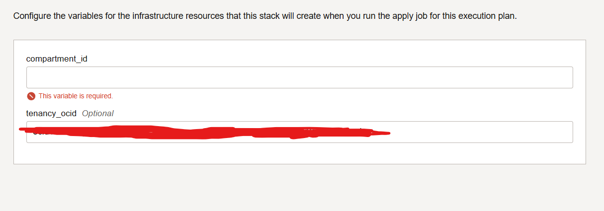

# OCI Terraform

## Require
- Terraform repository for Stack
- OCI account (admin role required)

## Guideline
### Configuration source providers
#### Docs
-  https://docs.oracle.com/en-us/iaas/Content/ResourceManager/Concepts/terraformconfigresourcemanager.htm
- https://docs.oracle.com/en-us/iaas/Content/ResourceManager/Concepts/resourcemanager.htm#concepts__stackdefinition
#### Steps
1. Set the source providers
2. Add the description (optional)
3. Choose compartment.
4. Choose Access Type: Public for Repo accessible for Internet/ Private for repo hosted privately
5. Choose and config the source repo

### Create Stacks
1. Choose source provider

2. Set Stack name, Add the description (optional), Choose compartment for create in.

3. Set up varibales.

4. Review and create

### Run a Stack
1. Choose the Stack want to run.
2. Choose the actions to run (Plan/Apply/Destroy)

